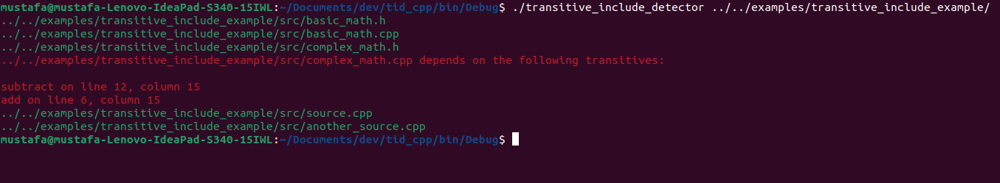
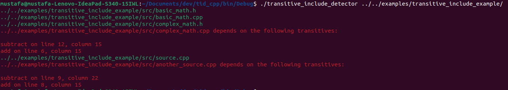
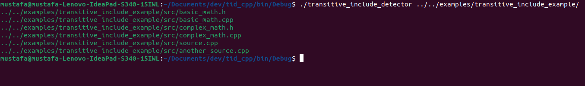

# Transitive Include Detector

**Transitive Include Detector** is a C++ tool that leverages **libclang** to detect and warn about transitive includes in C/C++ projects. Transitive includes occur when headers are indirectly included through other headers, often leading to compatibility issues when building projects in different environments.

---

## 📸 Screenshots

_Sample output for some cases_





---

## 🚀 Key Features

- Utilizes **libclang** for efficient and accurate parsing of C++ source files  
- Detects transitive includes within the codebase

---

## 🔧 Usage

1. Clone the repository:
   ```bash
   git clone https://github.com/yourusername/transitive-include-detector.git
2. Open .cbp file using Codeblocks
3. Build the project
4. ```cd bin/debug```
5. ```./transitive_include_detectos <path to project>```
6. ```./transitive_include_detector --help for all configurtion options```
